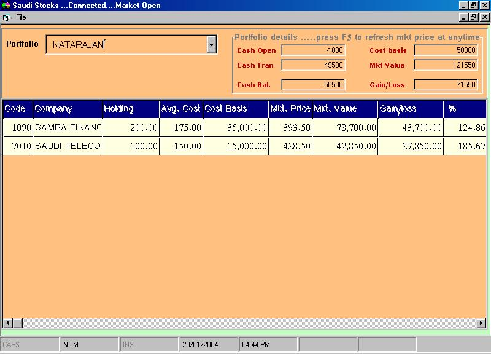



## Saudi Stock Exchange

### Description

The purpose of this code is to learn the method of getting stock prices from web sites
 
### More Info
 
Internet connection is require to run this project

This is the first submission of anything pertaining to sauid stock exchange, or I did not find anything similar. This code will get the stock prices from live market and update the portfolio.

Plzzzz vote for me and leave comments

             |
---                |---
**Submitted On**   |2004-01-13 09:32:20
**By**             |[Natarajan](https://github.com/Planet-Source-Code/PSCIndex/blob/master/ByAuthor/natarajan.md)
**Level**          |Intermediate
**User Rating**    |4.7 (14 globes from 3 users)
**Compatibility**  |VB 6\.0
**Category**       |[Complete Applications](https://github.com/Planet-Source-Code/PSCIndex/blob/master/ByCategory/complete-applications__1-27.md)
**World**          |[Visual Basic](https://github.com/Planet-Source-Code/PSCIndex/blob/master/ByWorld/visual-basic.md)
**Archive File**   |[Saudi\_Stoc1697091202004\.zip](https://github.com/Planet-Source-Code/natarajan-saudi-stock-exchange__1-51135/archive/master.zip)

